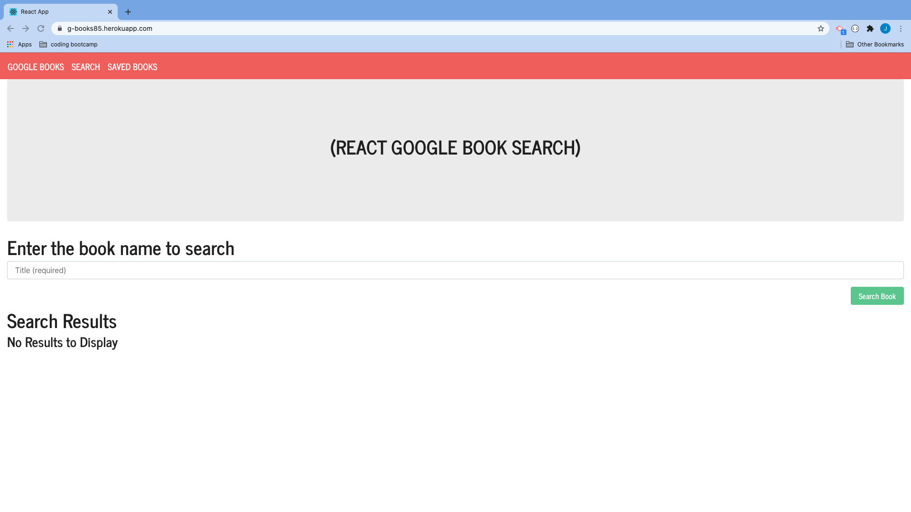
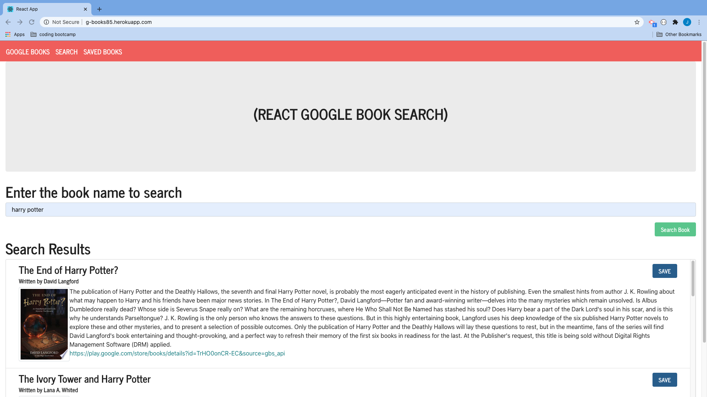
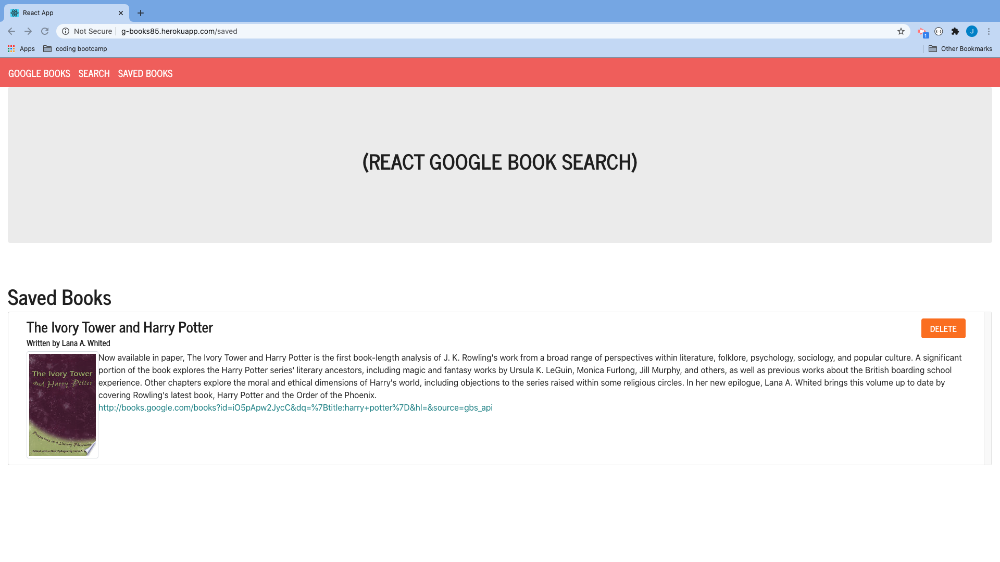

# Google Book App

## Table of Contents

* [Description](#description)
* [Installation](#installation)
* [Deployment](#deployment)
* [Screenshots](#screenshots)


## Description

Google books app allows the user to search for a book by title. This app uses "Google books" API to retrieve book info. This app allows the user to save books and review it later, it also allows to remove a book from saved list.

This is a full-stack project using the below technologies:

- React
- React Router Dom
- Node (Express)
- Moongoose

The front-end React app will auto-reload as it's updated via webpack dev server, and the backend Express app will auto-reload independently with nodemon.


## Installation

To starting the app locally follow the below steps

Start by installing front and backend dependencies. While in this directory, run the following command:

```
npm install
```

This should install node modules within the server and the client folder.

After both installations complete, run the following command in your terminal:

```
npm start
```

Your app should now be running on <http://localhost:3000>. The Express server should intercept any AJAX requests from the client.


## Deployment (Heroku)

To deploy, simply add and commit your changes, and push to Heroku. As is, the NPM scripts should take care of the rest.

The application is deployed as github pages and can be found at https://g-books85.herokuapp.com/


## Screenshots

### Landing Page
<br>

### Search Results Page
<br>

### Saved Book Page
<br>
